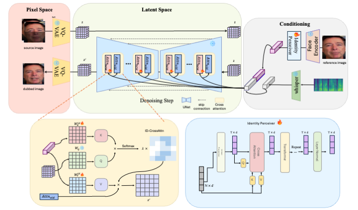

# UnAvgLip

We propose UnAvgLip,  which facilitates identity retention while maintaining audio synchronization through a lightweight identity adapter module. Our project is based on  [MuseTalk](https://github.com/TMElyralab/MuseTalk).  

Technical report: TODO

# Overview



Visual dubbing is the task of generating a talking face video where the lip movements and facial expressions of a speaker are synchronized with a given target audio. It aims to make the synthesized talking face appear as if the speaker is naturally pronouncing the provided speech, even if the original video was recorded in a different language or with different speech content.


The diffusion based  lip-sync model mainly learns to fuse audio feature representations into visual feature representations in the latent space through training with an extensive collection of utterances, but it struggles to maintain facial details concerning lips for unseen identity.


 To address this issue, we propose **UnAvgLip**, which extracts identity embeddings from reference videos to generate highly faithful facial sequences while maintaining perfect lip synchronization. Specifically, our method comprises two primary components: (1) an Identity Perceiver module that encodes facial embeddings for fusion with conditioned audio features; and (2) an ID-CrossAttn module module that injects facial embeddings into the generation process, enhancing focus on detailed facial feature synthesis. Extensive experiments demonstrate that, at a modest training cost, UnAvgLip effectively eliminates the averaging phenomenon in lip synthesis, significantly preserving unique facial characteristics while maintaining precise lip synchronization, achieving SoTA performance across various metrics such as Visual Quality and Identity Similarity on the **HDTF** dataset and **LRW** dataset.


## Installation

To prepare the Python environment and install additional packages such as opencv, diffusers, mmcv, etc., please follow the steps below:

### Build environment

We recommend a python version >=3.10. Create conda environment as follows:

```shell
conda create -n unavglip python=3.10 
conda activate unavglip
```

Install dependency packages via 

```shell
pip install -r requirements.txt
```

Install **ffmpeg** via

```
conda install -c conda-forge ffmpeg
```

### mmlab packages

```bash
pip install --no-cache-dir -U openmim 
mim install mmengine 
mim install "mmcv>=2.0.1" 
mim install "mmdet>=3.1.0" 
mim install "mmpose>=1.1.0" 
```

### Download weights

You can download weights manually as follows:

1. Download the weights of other components:
   1. [MuseTalk](https://huggingface.co/TMElyralab/MuseTalk).
   2. [sd-vae-ft-mse](https://huggingface.co/stabilityai/sd-vae-ft-mse)
   3. [whisper](https://openaipublic.azureedge.net/main/whisper/models/65147644a518d12f04e32d6f3b26facc3f8dd46e5390956a9424a650c0ce22b9/tiny.pt)
   4. [dwpose](https://huggingface.co/yzd-v/DWPose/tree/main)
   5. [face-parse-bisent](https://github.com/zllrunning/face-parsing.PyTorch)
   6. [resnet18](https://download.pytorch.org/models/resnet18-5c106cde.pth)
   7. [lip_sync_expert](https://iiitaphyd-my.sharepoint.com/personal/radrabha_m_research_iiit_ac_in/_layouts/15/onedrive.aspx?id=%2Fpersonal%2Fradrabha%5Fm%5Fresearch%5Fiiit%5Fac%5Fin%2FDocuments%2FWav2Lip%5FModels%2Flipsync%5Fexpert%2Epth&parent=%2Fpersonal%2Fradrabha%5Fm%5Fresearch%5Fiiit%5Fac%5Fin%2FDocuments%2FWav2Lip%5FModels&ga=1)
   8. id-perceiver (the weight will be released sooner.)
   9. id-cross-atten (the weight will be released sooner.)


Finally, these weights should be organized in `models` as follows:

```
./models/
├── musetalk
│   └── musetalk.json
│   └── pytorch_model.bin
├── dwpose
│   └── dw-ll_ucoco_384.pth
├── face-parse-bisent
│   ├── 79999_iter.pth
│   └── resnet18-5c106cde.pth
├── sd-vae-ft-mse
│   ├── config.json
│   └── diffusion_pytorch_model.bin
├── whisper
│   └── tiny.pt
├── lip_sync_expert
│   └──lipsync_expert.pth
└── adapter
    └── pytorch_model.bin
```

## How to train

### Data preprocessing

Here, we provide the script for data preprocessing via:

```
sh ./data.sh $input_data_dir $output_dir
```

$input_data_dir: The training data dir contains xxx.mp4

$output_dir: The preprocessed results

<h3>Data orgnization </h3>

```
./data/
├── images
│     └──RD_Radio10_000
│         └── 0.png
│         └── 1.png
│         └── xxx.png
│     └──RD_Radio11_000
│         └── 0.png
│         └── 1.png
│         └── xxx.png
├── audios
│     └──RD_Radio10_000
│         └── 0.npy
│         └── 1.npy
│         └── xxx.npy
│     └──RD_Radio11_000
│         └── 0.npy
│         └── 1.npy
│         └── xxx.npy
├── train.json
└── test.json
```

<h3>Training</h3>

Simply run after preparing the preprocessed data

```
cd train_codes
sh train.sh #--train_json="../data/train.json" \(Generated in Data preprocessing step.)
            #--val_json="../data/val.json" \
```

or run in the command line:

```
export VAE_MODEL="../models/sd-vae-ft-mse/"
export DATASET="../new_train_data"
export UNET_CONFIG="../models/musetalk/musetalk.json"

accelerate launch adapter_v_train.py \
--mixed_precision="fp16" \
--unet_config_file=$UNET_CONFIG \
--pretrained_model_name_or_path=$VAE_MODEL \
--data_root=$DATASET \
--train_batch_size=2 \
--gradient_accumulation_steps=1 \
--gradient_checkpointing \
--reconstruction \
--max_train_steps=10000 \
--learning_rate=1e-05 \
--max_grad_norm=3 \
--lr_scheduler="cosine" \
--lr_warmup_steps=0 \
--output_dir="adapterv0218" \
--val_out_dir='adapterv0218' \
--testing_speed \
--checkpointing_steps=5000 \
--validation_steps=100 \
--resume_from_checkpoint="latest" \
--syncnet_checkpoint_path="./models/checkpoints/lipsync_expert.pth" \
--use_audio_length_left=2 \
--use_audio_length_right=2 \
--whisper_model_type="tiny" \
--train_json="../train.json" \
--val_json="../test.json" \
--logging_dir="adapterv0218"
```

<h3>Inference</h3>

Here, we provide the inference script. 

```
python scripts.adapter_v_inference.py --inference_config ./configs/inference/test.yaml  --pretrained_adapter_path $PATH_TO_ADAPTER_CHECKPOINT
```

PATH_TO_ADAPTER_CHECKPOINT is the path to checkpoint directory
configs/inference/test.yaml is the path to the inference configuration file, including video_path,  audio_path, crop_path, face_embs_path and guide_scale.

**video_path**:  The video_path should be either a video file, an image file or a directory of images.  You are recommended to input video with `25fps`, the same fps used when training the model. If your video is far less than 25fps, you are recommended to apply frame interpolation or directly convert the video to 25fps using ffmpeg.

**audio_path**: The video_path should be .wav file format.

**crop_path**: The video_path should be cropped face frame with size **256 X 256. Leave it empty if not cropped. The script will crop video frames first.

**face_embs_path**: The face_embs_path should be .pt file that stores the Face ID embedding. Leave it empty if it is not obtained. The script will extract  Face ID embeddings from randomly selected N cropped face frame using insightface.

**n_cond**: The number of references. (We recommend 4 as default).

**guide_scale**: The weight factor of ID-CrossAttn. (from 0 to 1.0)

<h3>Evaluate</h3>
To evaluate visual quality and identity similarity between ground truth and generated image, we use the script:
```
python scripts.evaluate_clearness  --evaluate_config ./configs/evaluate/test.yaml
```
**gt_video_path**: The file path of ground truth video. The gt_video_path should be either a video file, an image file or a directory of images.  You are recommended to input video with `25fps`, the same fps used when training the model. If your video is far less than 25fps, you are recommended to apply frame interpolation or directly convert the video to 25fps using ffmpeg.

**generated_video_path**: The file path of generated video. The generated_video_path should be either a video file, an image file or a directory of images.  You are recommended to input video with `25fps`, the same fps used when training the model. If your video is far less than 25fps, you are recommended to apply frame interpolation or directly convert the video to 25fps using ffmpeg.

**gt_cropped**: The frames of ground truth video will be cropped to 256 X 256 size. A face detector will be used to crop the face.

**generated_cropped**: The frames of generated video will be cropped to 256 X 256 size. A face detector will be used to crop the face.

**face_embs_path**: The face_embs_path should be .pt file that stores the Face ID embedding. Leave it empty if it is not obtained. The script will extract  Face ID embeddings from randomly selected N cropped face frame using insightface.

**result_save_path**: The results dir.

To evaluate lip synchronization, we recommend [`syncnet`](https://github.com/joonson/syncnet_python).

# Acknowledgement

1. We thank open-source components like [MuseTalk](https://github.com/TMElyralab/MuseTalk/tree/train_codes),  [whisper](https://github.com/openai/whisper), [dwpose](https://github.com/IDEA-Research/DWPose), [face-alignment](https://github.com/1adrianb/face-alignment), [face-parsing](https://github.com/zllrunning/face-parsing.PyTorch), [S3FD](https://github.com/yxlijun/S3FD.pytorch). 
1. UnAvglip has been built on top of  [MuseTalk](https://github.com/TMElyralab/MuseTalk/tree/train_codes) has referred much to it.
1. MuseTalk has been built on [LRW](https://www.robots.ox.ac.uk/~vgg/data/lip_reading/lrw1.html) datasets.

Thanks for open-sourcing!

# Citation

```bib
@article{unavglip,
  title={Removing Averaging: Personalized Lip-Sync Driven Characters Based on Identity Adapter},
  author={Yanyu Zhu, Licheng Bai, Jintao Xu, Jiwei Tang},
  journal={arxiv},
  year={2025}
}
@article{musetalk,
  title={MuseTalk: Real-Time High Quality Lip Synchorization with Latent Space Inpainting},
  author={Zhang, Yue and Liu, Minhao and Chen, Zhaokang and Wu, Bin and Zeng, Yubin and Zhan, Chao and He, Yingjie and Huang, Junxin and Zhou, Wenjiang},
  journal={arxiv},
  year={2024}
}

```

# Disclaimer/License

1. `code`: The code of UnAvgLip is released under the MIT License. There is no limitation for both academic and commercial usage.
1. `model`: The trained model are not available now, we will release it sooner.
1. `other opensource model`: Other open-source models used must comply with their license, such as  `MuseTak`,`whisper`, `ft-mse-vae`, `dwpose`, `S3FD`, etc..